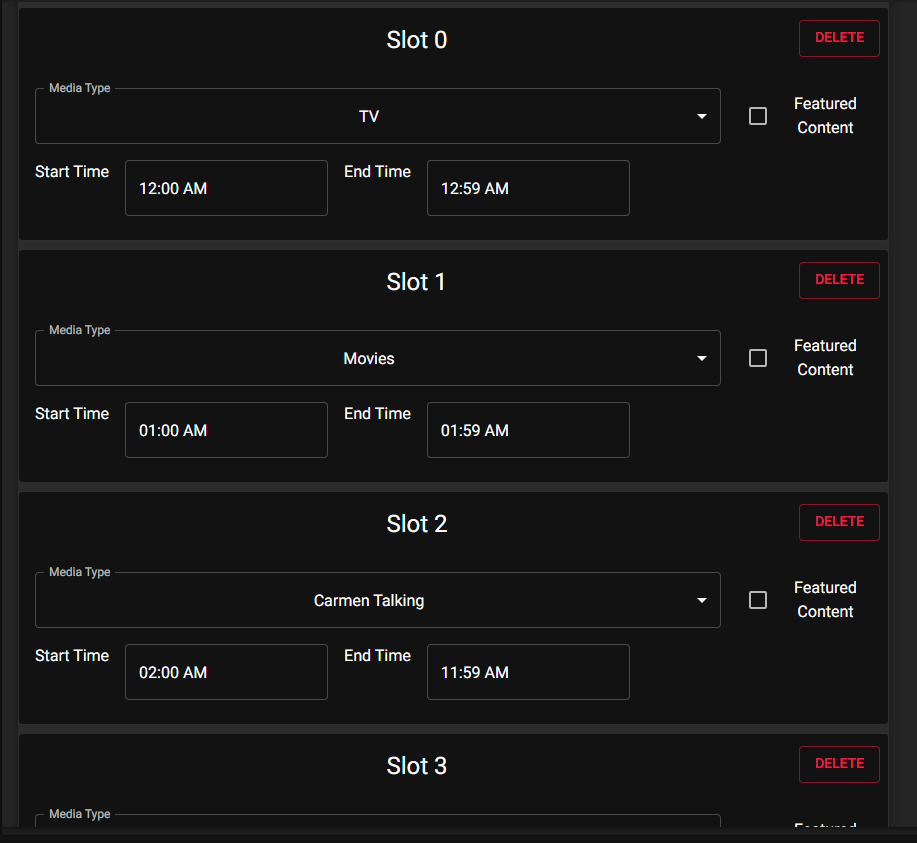

<p align="center"></p>
<p align="center"></p>
<p align="center"></p>

# Description
Have you ever wished you could have the cable TV experience, or a personalized 24 hour stream in your home with your own media? RBMP allows you to schedule a pleasant rain ambiance while you sleep, cartoons in the morning, cat TV for your pets in the afternoon, and a movie for dinner if you would like.

Anything is possible with RBMP's scheduling algorithm and category tagging system, you can make a daily media schedule that suits your life while RBMP's algorithm takes care of ensuring that the media for each slot is never the same two days in a row.

# Features
- Built-in Player
- Regenerate a daily media schedule if you don't like the the result
- Use custom categories to tag your media and the slot scheduling system to set your timeslots, after that let RBMP take care of it
- Multiple easy to switch between configurations for schedule generation
- Dynamic number of time slots with custom start and end times
- Filler content type to play whenever there is no scheduled media
- New dynamically generated content schedule each day based on the schedule configuration you select
- Want a movie to play within a slot but don't want another movie to start after it's done? Select 'Featured Content' to ensure that only one piece of media is the star of the slot

## Coming Soon
- Casting to IoT devices
- Swapping between schedules automatically based on day or season
- Better UI, right now we're still running with an alpha user interface design
- Add Archive - Import entire directory trees using each subfolder name as the category tag for its media files
- The rest can be seen in [Issues](https://github.com/Carmen-Git-It/RBMP/issues)
- Export generated playlists to other media management tools

# Installation / Running

## From Source

- Download the project source from this repository

### Install Dependencies

```
$ cd my-app

# using yarn or npm
$ yarn (or `npm install`)

# using pnpm
$ pnpm install --shamefully-hoist
```

### Use it

```
# development mode
$ yarn dev (or `npm run dev` or `pnpm run dev`)

# production build
$ yarn build (or `npm run build` or `pnpm run build`)
```

## From release

- Currently Unavailable
